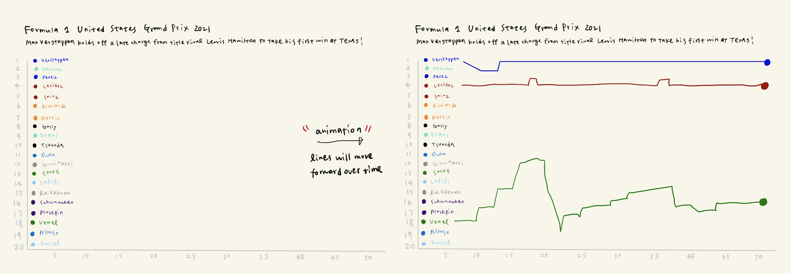

In this assignment, I utilized the knowledge I learned from [Design and Redesign in Data Visualization](https://medium.com/@hint_fm/design-and-redesign-4ab77206cf9): chose a public data visualization, critiqued the visualization, wireframed a solution using Balsamiq, conducted user innterviews to test the solution, and built the final solution using Flourish.

## Step 1 - Find a Data Visualization
I selected the Formula 1 United States Grand Prix 2021 Race Lap Chart.

#### Inspiration
I've been obssessed with F1 races since I watched the F1 documentaty series titled [Formula 1: Driving to Survive](https://www.netflix.com/title/80204890) on Netflix. After every race, there will be a tons of data visualization on the social media, summing up the race highlights and the updated ranking. For this assignment, I wanted to express the data in an engaging way that is friendly not just to those who have been watching the sport but to those who are new to the sport.

Image sourced from: [2021 United States Grand Prix interactive data: lap charts, times and tyres](https://www.racefans.net/2021/10/25/2021-united-states-grand-prix-interactive-data-lap-charts-times-and-tyres/)

## Step 2 - Critique the Data Visualization
I critiqued the data visualization using the criteria introduced in [Data Visualization Effectivenness Profile](http://www.perceptualedge.com/articles/visual_business_intelligence/data_visualization_effectiveness_profile.pdf) by Stephen Few.

| Criteria       | Score         | Scale (0 to 10)                                                       |
| -------------  | ------------- | --------------------------------------------------------------------- |
| Usefulness     | 8             | Useless vs. Very useful                                               |
| Completeness   | 8             | No relevant data vs. All relevant data                                |
| Perceptibility | 4             | Unclear and diffucult vs. Clear and easy                              |
| Truthfulness   | 10            | Innaccurate and invalid vs. Accurate and valid                        |
| Intuitiveness  | 4             | Unfamiliar; difficult to understand vs. Familiar; easy to understand  |
| Aesthetics     | 3             | Ugly vs. Pleasing to the eye                                          |
| Engagement     | 8             | Distracts from data vs. Draws one into the data                       |

The visualization exemplifies the positions of each driver on every lap in the United States Grand Prix 2021. The information is presented in the line chart, which is a nice approach to track changes over a period of time. Sadly, though the information is useful and complete, the color scheme and labels for the x- and y-axis made the comparison unnecessarily difficult. In particular, the laps across the x-axis could have been in uniform increments to reduce clutter. Additionally, the rank on the y-axis is confusing since it goes from 20 to 1, meaning the driver increasing on the y-axis is decreasing in the rank. This is counterintuitive as most audiences would assume the line at the top is ranked first place.

The primary audience are the fans and sports analysts, who have background knowledge about Formula 1 (e.g., drivers and teams). Therefore, I think the visualization is effective for reaching these audiences. However, there is still room for improvement. If I were to redesign the visualization, I would do the following changes:
- Change the color scheme. Note that there are 10 teams in Formula 1 and every team has 2 drivers. To make each variable discrete but not overwhelming, I would group the drivers by teams for the audience to relate more easily.
- Adjust the lables on x- and y-axis. I would reverse the values on y-axis and place the x-axis labels in uniform increment to make the chart clearer and more readible. 
- Add a subtitle. I would add a sentence or two for the highlights of the race that can potentially draw more viewers.

## Step 3 - Wireframe the Visualization
I chose to wireframe out the solution on the tablet. The first idea that came to mind was to make this visualization animated, but I realized this was difficult to present in just a picture. I ended up only adding a note between the two charts indicating the visualization will be in an animated formate, and the lines will move forward over time.

## Step 4 - Test the Solution
I shared the wireframe with two of my friends and ask for their feedback with the following questions. Respondent 1 knonws a lot about Formula 1 while Respondent 2 has little knowledge about it. This would allow me to have more balanced insights into the experiences between two different groups, and perhaps to further define the target user group.

The questions and responses are as follows.
- Can you tell me what you think this is? 
  - Response 1: The changes in ranking in the Uninted States Grand Prix.
  - Response 2: The changes in some metric of 20 persons over 50 days.
- Can you describe to me what this is telling you?
  - Response 1: The changes in ranking of 3 drivers (Verstappen, Leclarc, and Vettel)
  - Response 2: The result for Vettle is unstable and the results for the other two personsn are relatively stable.
- Is there anything you find surprising or confusing?
  - Response 1: The subtitle is too long to read.
  - Response 2: It's confusing that most people do not have data.
- Who do you think is the intended audience for this? 
  - Response 1: F1 fans and people who are interested in F1 racing data.
  - Response 2: Voters.
- Is there anything you would change or do differently?
  - Response 1: Shorten the subtitle.
  - Response 2: Moving those three with data to the top of the chart.

#### Reflection

## Step 5 - Build the Solution
I redesigned the visualization into an animated line chart to show the changing rank over the race.

